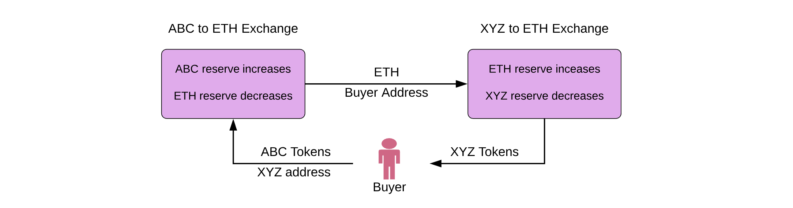

# Getting Started

Designed with simplicity in mind Uniswap provides an interface for seamless exchange of ERC20 tokens on Ethereum. By eliminating unnecessary forms of rent extraction and middlemen it allows faster, more efficient exchange. Where it makes tradeoffs, decentralization, censorship resistance, and security are prioritized. 

Uniswap is open source and functions as a public good. There is no central token or platform fee. No special treatment is given to early investors, adopters, or developers. Token listing is open and free. All smart contract functions are public and all upgrades are opt-in. 

This site will serve as a project overview for Uniswap - explaining how it works, how to use it, and how to build on top of it. These docs are actively being worked on and more information will be added soon.

## Uniswap V1 Features

* Add support for any ERC20 token using the Uniswap factory
* Join market making pools to collect fees on ETH-ERC20 pairs
* Liquidity-sensitive automated pricing using constant product formula
* Trade ETH for any ERC20 without wrapping
* Trade any ERC20 for any ERC20 in a single transaction 
* Trade and transfer to a different address in a single transaction
* Lowest gas cost of any decentralized exchange
* Support for private and custom uniswap exchanges
* Buy ERC20 tokens from any wallet using ENS
* Partially verified smart contracts written in Vyper
* Mobile optimized open source frontend implementation  
* Funded through an Ethereum Foundation grant

## Resources

* [Website](https://uniswap.io/)
* [Github](https://github.com/uniswap)
* [Whitepaper](https://hackmd.io/C-DvwDSfSxuh-Gd4WKE_ig#Uniswap-Whitepaper-%F0%9F%A6%84)
* [Reddit](https://www.reddit.com/r/UniSwap/)
* [Slack](https://join.slack.com/t/uni-swap/shared_invite/enQtNDYwMjg1ODc5ODA4LWEyYmU0OGU1ZGQ3NjE4YzhmNzcxMDAyM2ExNzNkZjZjZjcxYTkwNzU0MGE3M2JkNzMxOTA2MzE2ZWM0YWQwNjU)
* [Twitter](https://twitter.com/UniswapExchange)
* [Email](mailto:hayden@uniswap.io?Subject=Uniswap%20Feedback)

## How it works

Uniswap is made up of a series of ETH-ERC20 exchange contracts. There is exactly one exchange contract per ERC20 token. If a token does not yet have an exchange it can be created by anyone using the Uniswap factory contract. The factory serves as a public registry and is used to look up all token and exchange addresses added to the system.

Each exchange holds reserves of both ETH and its associated ERC20 token. Anyone can become a liquidity provider on an exchange and contribute to its reserves. This is different than buying or selling; it requires depositing an equivalent value of both ETH and the relevant ERC20 token. Liquidity is pooled across all providers and an internal "pool token" \(ERC20\) is used to track each providers relative contribution. Pool tokens are minted when liquidity is deposited into the system and can be burned at any time to withdraw a proportional share of the reserves. 

Exchange contracts are automated market makers between an ETH-ERC20 pair. Traders can swap between the two in either direction by adding to the liquidity reserve of one and withdrawing from the reserve of the other. Since ETH is a common pair for all ERC20 exchanges, it can be used as an intermediary allowing direct ERC20-ERC20 trades in a single transaction. Users can specify a recipient address if they want to receive purchased tokens at a different address from the one used to make a transaction. 

Uniswap uses a "constant product" market making formula which adjusts the exchange rate based off of the relative sizes of the reserves and the incoming trade. For example, an ETH-to-ERC20 trade increases the size of the ETH reserve and lowers the size of the ERC20 reserve. This shift in reserve ratio increases the ERC20 token's price relative to ETH. The greater the shift in ratio, the worse of an exchange rate the buyer will receive. This is called price slippage, and it can be avoided by making trades that are small relative to total liquidity supplies. 

A small liquidity provider fee \(0.3%\) is taken out of each trade and added to the reserves. While the ETH-ERC20 reserve ratio is constantly shifting, fees makes sure that the total combined reserve size increases with every trade. This functions as a payout to liquidity providers that is collected when they burn their pool tokens to withdraw their proportional share of total reserves. 

Since Uniswap is entirely on-chain, prices can change between when a transaction is signed and when it is included in a block. Traders can bound these price fluctuations by specifying the minimum amount bought on sell orders, or the maximum amount sold on buy orders. This acts as a limit order that will automatically cancels if it is not filled. It is also possible to set transaction deadlines which will cancel orders if they are not executed fast enough.  

The reason there is only one exchange per token is to encourage users 

