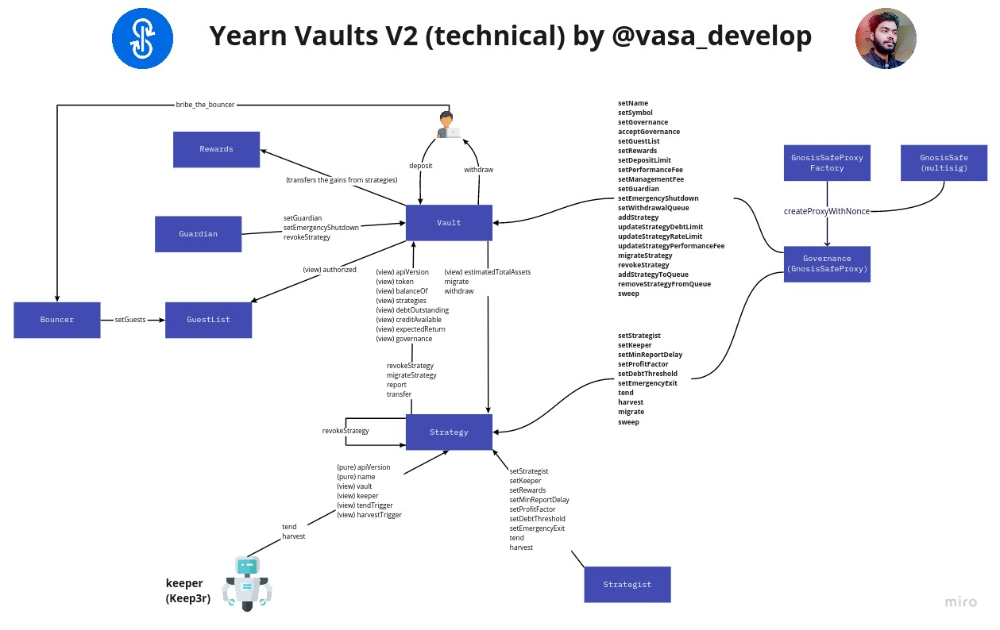

# V2 yVaults

V2 yVaults are a new vault's infrastructure developed by Yearn.

### Finding current LIVE vaults and their strategies

Go to the [YearnV2 Subgraph](https://thegraph.com/explorer/subgraph/dmolina79/yearn-vaults-v2) and query the following

```text
{
  vaults(where: {
    apiVersion: "0.3.0",
    classification: Endorsed
  }) {
    id
    shareToken {
      id
      name
   symbol
    }
    classification
    apiVersion
    token {
      id
      name
    }
    strategies {
      id
    }
  }
}
```

### Getting started with V2 yVaults development

If you want to run the yVaults version 2 in your local machine and start learning about this new infrastructure and strategies, follow the instructions in this [repo](https://github.com/iearn-finance/brownie-strategy-mix).


