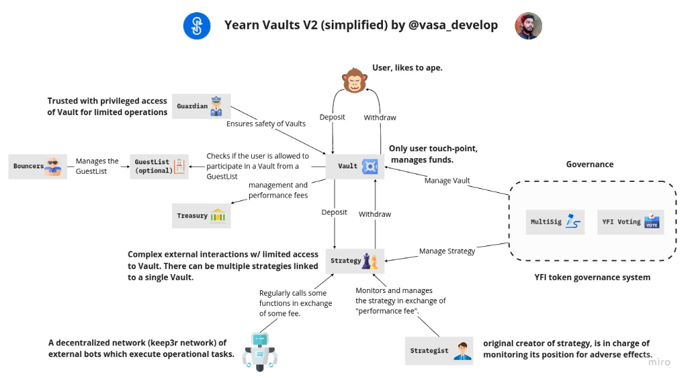

# V2 yVaults

V2 yVaults main objective is to improve capital efficiency compared to V1 yVaults.

You can find V2 vaults at: [https://yearn.finance/vaults](https://yearn.finance/vaults)

### V2 yVaults main improvements are:

1. **Up to 20 strategies per vault:** this will increase the flexibility to manage capital efficiently during different market scenarios. Each strategy has a capital cap. This is useful to avoid over allocating funds to a strategy which cannot increase APY anymore.
2. **Strategist and Guardian are the new Controllers:** the Controller concept is not available in V2 yVaults and has been replaced by a Guardian and the Strategy creator \(strategist\). These 2 actors oversee strategy performance and are empowered to take action to improve capital management or act on critical situations.
3. **Automated vault housekeeping \(Keep3r network\):** `harvest()` and `earn()` calls are now automated through the Keep3r bots network. These 2 function calls are used to purchase new underlying collateral by selling the farmed tokens while moving the profits back to the vault and later into strategies. The keep3r network takes the heavy lifting of doing these calls and running with the gas costs in exchange for keep3r tokens. This approach unloads humans from these housekeeping tasks.
4. **Bouncers and Guest lists**: Yearn has created an unique development process for new vaults. All vaults are launched as Test Vaults \(tyvToken\) to start with. Test vaults have a cap and therefore their strategies as well. Also, the Bouncer has a guest list of wallets which can interact by depositing and withdrawing funds in the Test Vaults. This approach prevents uninformed users from potentially losing funds in a not production ready product.

