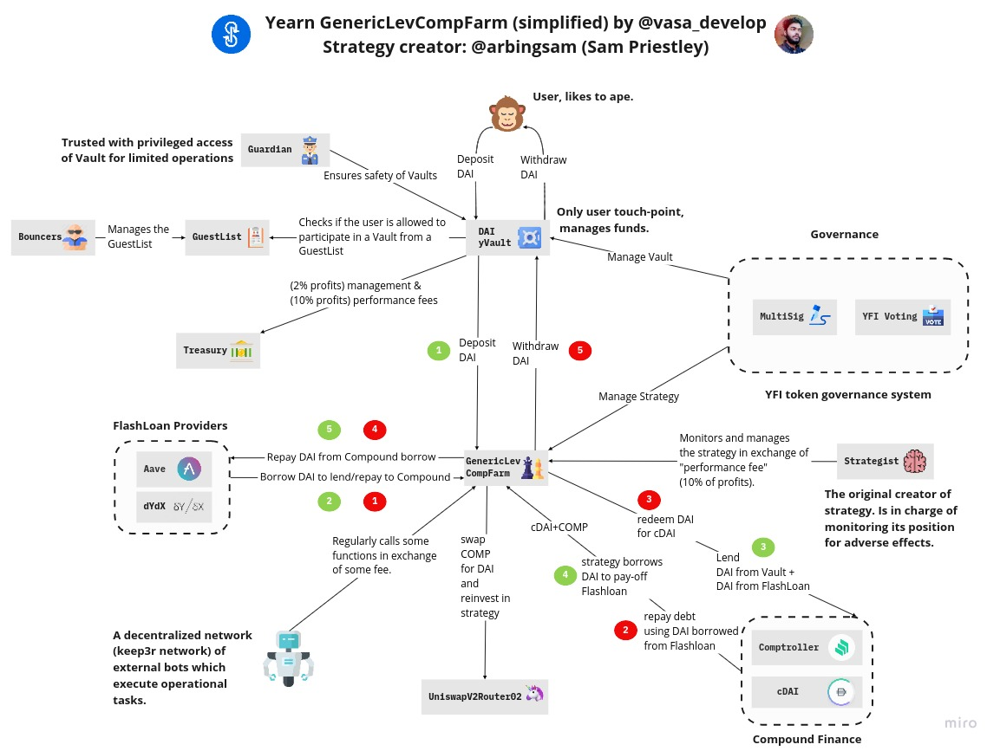
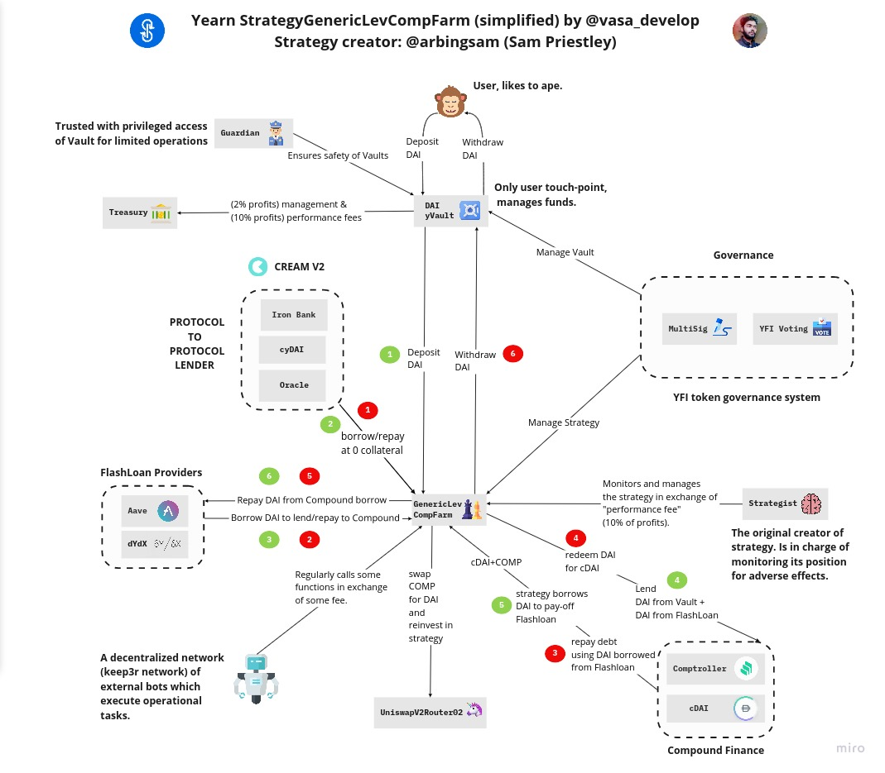
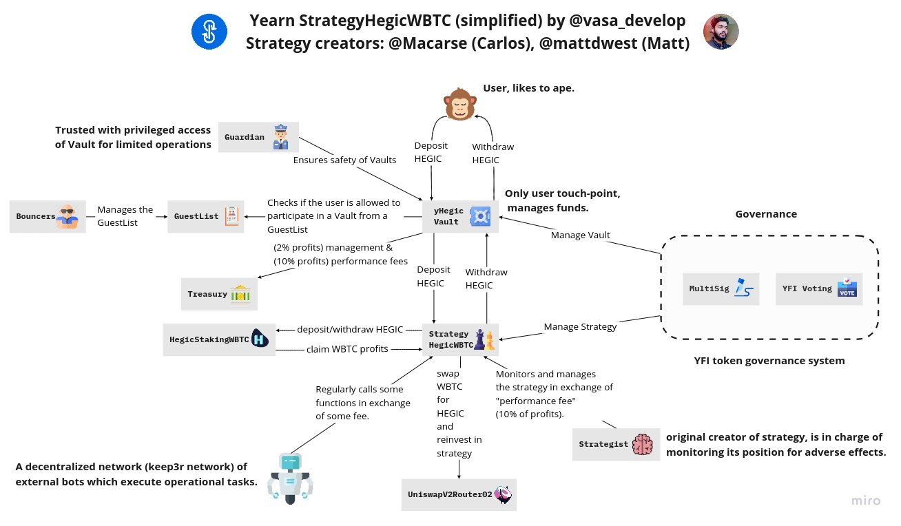
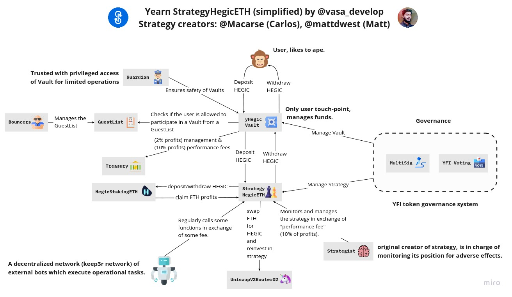

# Strategies and yVaults available

Yearn is always developing new vaults and many new strategist for existing vaults.

Here is a summary of current, future and in development vaults and strategies.

To check which vaults are currently LIVE, please, have a look at the V2 yRegistry

## [DAI yVault](https://etherscan.io/address/0x19d3364a399d251e894ac732651be8b0e4e85001) Strategies

### [StrategyGenericLevCompFarm](https://etherscan.io/address/0x4031afd3b0f71bace9181e554a9e680ee4abe7df)

### StrategyGenericLevCompFarm with Iron Bank from CREAM \(currently in testing only\)

### [HEGIC ](https://etherscan.io/address/0xe11ba472f74869176652c35d30db89854b5ae84d)yVault

### [StrategyHegicWBTC](https://etherscan.io/address/0x0ce77bc655afaac83947c2e859819185966ca825#code)

### [StrategyLenderYieldOptimiser](https://etherscan.io/address/0x0cf55d57d241161e0ec68e72cbb175dbfe84173a)

### [StrategyHegicETH](https://etherscan.io/address/0x41d638024c525c70a53b883608048e705e061f2c)

### USDC yVault

### [StrategyGenericLevCompFarm](https://etherscan.io/address/0x4d7d4485fd600c61d840ccbec328bfd76a050f87) \(also used in DAI yVault\)

